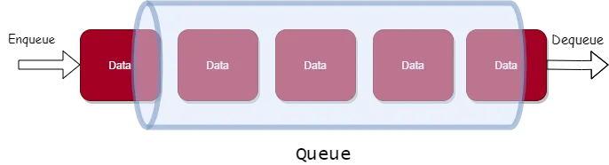

# Implementing a Queue in Go

A queue is an abstract data structure (ADT) that follows a particular order in which the operations are performed.
It follows the First In First Out (LIFO) order for operations.
In a layman example, a queue is any queue of consumers for a resource where the consumer that came first is served first.

The difference between a queue and a stack is the removal order, in a stack, we remove the item the most recently added; in a queue, we remove the item the least recently added.



# Representation
We would start by defining the basic building block for our implementation i.e. defining a struct for Queue that would be backed by Array or a slice in golang terminology.

```go
// Queue := := Queue implementation backed by Array/Slice
type Queue struct {
	data []int
}
```

## Variables

* Queue: backed by an integer slice which will hold our data.

# Operations
We would be defining the below operations on our queue for demonstration purposes.

* Enqueue()
* Dequeue()
* Peek()
* Size()
* Print()

So, let us start with implementing the above-defined methods.

Before we start with the implementation we would be creating a method that would create a new ArrayQueue object which will be utilized by our defined methods.

# NewQueue:
This method will create a new instance of our Queue with the initial capacity as a parameter.

```go
// NewQueue :=  Creates a new Queue with the provided capacity
func NewQueue(capacity int) *Queue {
	queue := new(Queue)
	queue.data = make([]int, capacity)
	return queue
}
```

# Enqueue
Enqueue method will take in data as a parameter which in our instance would be of type int.
As we know Queue follows FIFO order for insertion and removal of data, thus the data would be added at the front of the queue and will be moved further upon additions of a new element.

```go
// Enqueue := inserts the element at the front of the queue
func (queue *Queue) Enqueue(data int) {
	queue.data = append(queue.data, data)
}
```

# Dequeue:
Dequeue method will return the data from the back of the queue and delete the same from the queue.

```go
// Dequeue := removes the element from the back of the queue
func (queue *Queue) Dequeue() (int, error) {
	if queue.Size() == 0 {
		return 0, errors.New("queue is empty")
	}
	data := queue.data[0]
	queue.data = queue.data[1:]
	return data, nil
}
```

# Peek:
Peek is similar to the dequeue method, the only difference between them is that while using Peek we will not the deleting the element from the queue.

```go
// Peek := Returns the element at front of the queue without deleting it
func (queue *Queue) Peek() (int, error) {
	if queue.Size() == 0 {
		return 0, errors.New("queue is empty")
	}
	return queue.data[0], nil
}
```

# Size:
The size of the queue will be calculated by length of the queue.

```go
// Size :=  return the size of the Queue
func (queue *Queue) Size() int {
	return len(queue.data)
}
```

# Print:
To print all the elements in the queue we would iterate over the queue from location Front -> Back

```go
// Print := prints all the element in the queue
func (queue *Queue) Print() {
	for i := 0; i < len(queue.data); i++ {
		fmt.Printf("%v | ", queue.data[i])
	}
	fmt.Println()
}
```
Now that we have completed our implementation it’s time to run the [code](https://go.dev/play/p/RInu1JgW9Lh)

# Output

```
0 | 0 | 1 | 2 | 3 | 
5
0 <nil>
0 <nil>
1 <nil>
2 | 3 | 
2 <nil>
3 <nil>
0 queue is empty
4 | 
```
Conclusion
This brings us to the end of the article. Thank you for your time.
The code in the discussion is available at [this](https://github.com/siashish/DataStructures_In_GO/blob/main/Queue/queue.go) link.

There is advance version of queue implemetion avaliable.
[code](https://github.com/siashish/DataStructures_In_GO/blob/main/Queue/queueadvance.go) and [Go Playground](https://go.dev/play/p/13zKywB7Ft-) link