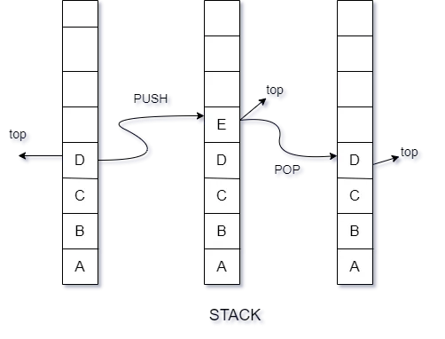

# Implementing a Stack in Go

Stacks are fundamental data structures widely used in computer science and software development. They follow the Last In, First Out (LIFO) principle, meaning the last element added to the stack is the first one to be removed. In this blog post, we'll explore how to implement a stack in Go, a powerful and efficient programming language.

## What is a Stack?

Before diving into the implementation details, let's briefly discuss the concept of a stack. Imagine a stack of plates where you can only add or remove a plate from the top. This is analogous to how a stack data structure works in computing.



A stack has two primary operations:

1. **Push:** Adds an element to the top of the stack.
2. **Pop:** Removes and returns the element at the top of the stack.

Additionally, stacks typically include a method to check if the stack is empty and another to peek at the top element without removing it.

So, let us start first with defining our backbone structure for the Stack object.
It will have the following structure:

 * Array: to store the data
 * Top: pointer to the top of the stack
 * Capacity: current capacity of the stack.


```go
//Stack definition of stack object
type Stack struct {
    top        int
    capacity   int
    stackArray []interface{}
}
```

**Push Operation:**
   This operation will take the data as the input, and store the same, at the same time the top variable is incremented to point to the last element.

    If we try to insert an element when the stack has reached its capacity, it is known as “overflow”.

   ```go
   //Push inserts the data in the top of the stack
    func (stack *Stack) Push(data interface{}) error {
        if stack.IsFull() {
            return errors.New("stack overflow")
        }
        stack.top++
        stack.stackArray[stack.top] = data
        return nil
    }
   ```

**Pop Operation:**
   This method will return the data present at the top of the stack and decrement the top pointer to point to the latest element in the stack.

    If we try to pop out of an empty stack, it is known as “underflow”.

   ```go
   //Pop removes the data from the top of the stack
    func (stack *Stack) Pop() (interface{}, error) {
        if stack.IsEmpty() {
            return nil, errors.New("stack underflow")
        }
        temp := stack.stackArray[stack.top]
        stack.top--
        return temp, nil
    }
   ```

**Peek Operation:**
   The Peek method is the same as that of Pop, the only difference is that it does not delete the top element from the stack.

   ```go
   //Peek returns the data without removing from the top of stack
    func (stack *Stack) Peek() (interface{}, error) {
        if stack.IsEmpty() {
            return nil, errors.New("stack underflow")
        }
        temp := stack.stackArray[stack.top]
        return temp, nil
    }
   ```

**Empty Check:**
   The `IsEmpty` method checks if the stack is empty.

   ```go
   // IsEmpty checks whether the stack is empty
    func (stack *Stack) IsEmpty() bool {
        return stack.top == -1
    }
   ```

## Putting it All Together

Now that we've defined the `Stack` struct and its methods, let's see how we can use the stack in practice:

See the whole code in [stack.go](https://github.com/siashish/DataStructures_In_GO/blob/main/Stack/stack.go) file


In this example, we create a new stack, push elements onto it, peek at the top element, pop elements, and check if the stack is empty. The output demonstrates the expected behavior of a stack following the LIFO principle.

## Conclusion

Implementing a stack in Go is straightforward and can be achieved using a slice as the underlying data structure. By defining methods for push, pop, peek, and isEmpty operations, we can create a reusable and efficient stack data structure to manage elements in our programs. Stacks are versatile and find applications in various algorithms and problem-solving scenarios.
